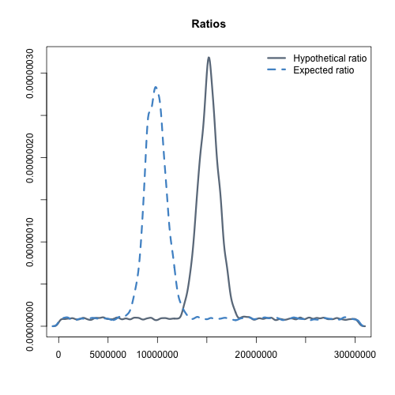
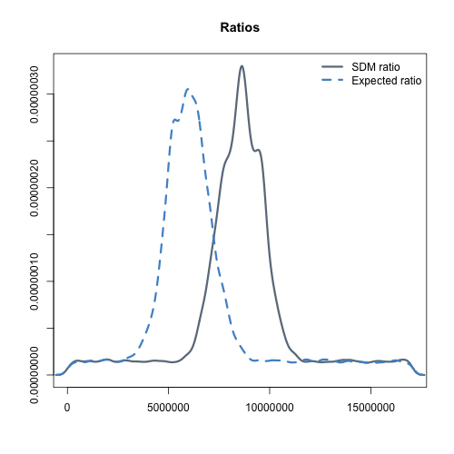
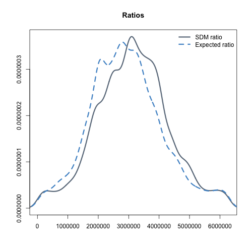
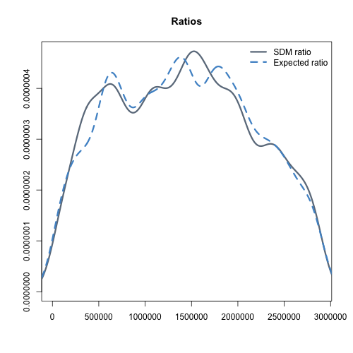
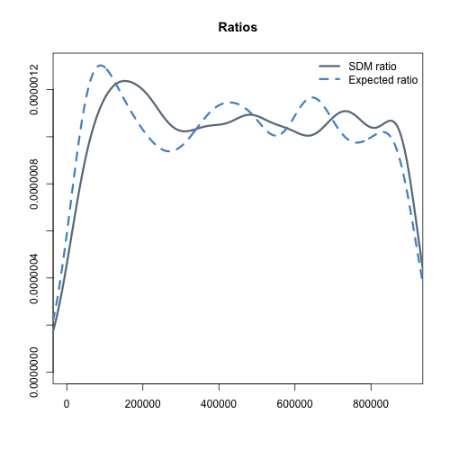

###Analysing effect of pre-filtering step

Model genomes based on Arabidopsis chromosome 1 (~30 Mb). 

SDM pipeline calculates the ratio hom/het for each contig and then uses this value as a threshold to discard the contigs located far from the causal mutation. 
The ratio of homozygous to heterozygous SNPs on a contig n is defined as the sum homozygous SNPs on n plus 1 divided by the sum of heterozygous SNPs plus 1. 

If the filtering step is required, the threshold astringency is provided as an integer (1, 5, 10, 20). Each integer represents the percentage of the maximum ratio below which a contig will be discarded. In example, if 1 is specified, SDM will discard those contigs with a ratio falling below 1% of the maximum ratio while a value of 20 is more astringent  will discard those contigs with a ratio falling below 20% of the maximum ratio. 

- 1 -> threshold = 1% of the maximum ratio. Divide maximum ratio by 100 
- 5 -> threshold = 5% of the maximum ratio. Divide maximum ratio by 50
- 10 -> threshold = 10% of the maximum ratio. Divide maximum ratio by 10
- 20 -> threshold = 20% of the maximum ratio. Divide maximum ratio by 5

<table>
 <tr><th>Name <th>Contig length</th> <th>Mean of rnorm distribution</th>
 <tr><th>chr1_right <th>10000 </th> <th>20000000</th>
 <tr><th>chr1_left <th>10000 </th> <th>10000000</th>
   
</table>


```
ruby SNP_distribution_method_variation.rb Small_genomes/arabidopsis_datasets/Analyse_effect_ratio/chr1_left Ratio_1_1 1 back
ruby SNP_distribution_method_variation.rb Small_genomes/arabidopsis_datasets/Analyse_effect_ratio/chr1_left Ratio_5_1 2 1 back
ruby SNP_distribution_method_variation.rb Small_genomes/arabidopsis_datasets/Analyse_effect_ratio/chr1_left Ratio_10_1 10 1 back
ruby SNP_distribution_method_variation.rb Small_genomes/arabidopsis_datasets/Analyse_effect_ratio/chr1_left Ratio_20_1 20 1 back
ruby SNP_distribution_method_variation.rb Small_genomes/arabidopsis_datasets/Analyse_effect_ratio/chr1_left Ratio_0_1 0 1 back
```


###1% of the maximum ratio


###5% of the maximum ratio

###10% of the maximum ratio

###20% of the maximum ratio

